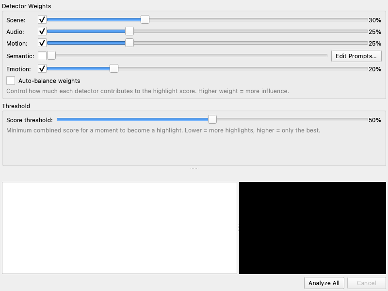

# ClipShow

ClipShow is a desktop app that turns your raw video clips into a highlight reel automatically. Point it at your footage, and it finds the most interesting moments using scene changes, audio peaks, motion, and optional AI-powered content analysis, then stitches them together into a single video.

## How It Works

ClipShow runs several **detectors** on your video files:

- **Scene change** — spots hard cuts and transitions between shots
- **Audio peaks** — finds loud moments, speech, beats, and cheers
- **Motion** — detects fast-moving action on screen
- **Semantic (optional)** — uses a CLIP AI model to find frames matching text descriptions you choose (e.g. "crashes", "celebrations", "beautiful scenery")
- **Emotion (optional)** — detects faces and flags moments with happy or surprised expressions

Each detector produces a score over time. ClipShow combines these scores using weights you control, then picks segments that rise above a threshold. You can preview, reorder, and trim those segments before exporting the final highlight reel.

## Screenshots

| Import | Analyze |
|--------|---------|
|  |  |

| Review | Export |
|--------|--------|
|  |  |

## Installation

### Download (recommended)

Grab the latest build for your platform from the [Releases page](https://github.com/borgel/clipshow/releases):

| Platform | Download |
|----------|----------|
| macOS (Apple Silicon) | `ClipShow-*.dmg` |
| Windows | `ClipShow-*-setup.exe` |
| Linux | `ClipShow-*.flatpak` |

FFmpeg is bundled in the release builds — no extra setup needed.

Each platform has two variants:

| Variant | Size | AI features | Internet needed? |
|---------|------|-------------|------------------|
| **Lite** | ~150 MB | Downloads CLIP model (~340 MB) on first use of semantic detection | Yes, on first use |
| **Full** | ~800 MB | CLIP model bundled, works immediately | No |

Both variants include all core detectors (scene, audio, motion, emotion). The size difference is entirely the bundled CLIP ViT-B/32 ONNX model used for semantic detection. If you don't plan to use text-based semantic search, the lite build is all you need.

### Install from source

If you prefer to run from source or want to contribute:

**Prerequisites:**
- Python 3.11 or 3.12
- FFmpeg installed and on your PATH (`brew install ffmpeg` / `sudo apt install ffmpeg` / `choco install ffmpeg -y`)

```bash
git clone https://github.com/borgel/clipshow.git
cd clipshow
uv sync
```

#### Optional dependencies

For AI-powered semantic detection (CLIP model, ~340 MB download on first use):

```bash
uv sync --extra semantic
```

For face/emotion detection (uses ONNX Runtime, downloads a small ~35 KB model on first use):

```bash
uv sync --extra emotion
```

## Usage

### GUI mode (default)

```bash
clipshow          # from a release build
uv run clipshow   # from source
```

This opens the four-step workflow:

1. **Import** — drag and drop video files or use the file browser
2. **Analyze** — adjust detector weights and threshold, then click "Analyze All"
3. **Review** — preview detected segments, reorder by dragging, trim with nudge buttons, uncheck segments you don't want
4. **Export** — pick an output path and click "Export"

You can also open the **Edit > Preferences** menu to change all settings in one place.

### Auto mode

Process videos and produce a highlight reel with one command:

```bash
clipshow --auto --output reel.mp4 video1.mp4 video2.mov
```

A minimal progress window is shown. All segments above the threshold are included, sorted chronologically.

### Headless mode

For scripting or batch jobs — no GUI at all:

```bash
clipshow --auto --headless --output reel.mp4 *.mp4
```

### CLI flags

| Flag | Description |
|------|-------------|
| `--auto` | Run automatic mode (no full UI) |
| `--headless` | Suppress all GUI (implies `--auto`) |
| `--output`, `-o` | Output file path (default: `highlight_reel.mp4`) |
| `--workers`, `-j` | Number of parallel workers (default: auto = CPU count) |
| `--config`, `-c` | Path to a YAML pipeline configuration file |
| `--version` | Print version and exit |

### Pipeline configuration file

For repeatable batch processing, create a YAML config file instead of passing all settings as CLI flags:

```bash
clipshow --auto --config pipeline.yaml
```

Example `pipeline.yaml`:

```yaml
inputs:
  - "vacation/*.mp4"
  - "party/clip1.mov"

output:
  path: "highlight_reel.mp4"
  codec: libx264
  fps: 30.0
  bitrate: "8M"

detectors:
  scene: 0.3
  audio: 0.25
  motion: 0.25
  semantic: 0.0
  emotion: 0.2

semantic:
  prompts:
    - "exciting moment"
  negative_prompts:
    - "boring static shot"

segments:
  threshold: 0.5
  min_duration: 1.0
  max_duration: 15.0
  pre_padding: 1.0
  post_padding: 1.5

workers: 0
```

All sections are optional. Glob patterns in `inputs` resolve relative to the YAML file's directory. CLI arguments (`--output`, positional files, `--workers`) take precedence over values in the config file.

## Customizing Detection

All settings are stored in `~/.clipshow/settings.json` and can be edited in the GUI via **Edit > Preferences**.

### Detector weights

Each detector has a weight from 0.0 (disabled) to 1.0 (full strength). Defaults:

| Detector | Default weight |
|----------|---------------|
| Scene | 0.30 |
| Audio | 0.25 |
| Motion | 0.25 |
| Semantic | 0.00 (disabled) |
| Emotion | 0.20 |

Set a weight to 0 to disable a detector entirely.

### Threshold and duration

- **Score threshold** (default 0.5) — only moments scoring above this are kept. Lower it to get more clips, raise it for only the best moments.
- **Pre-padding** (default 1.0 s) — seconds of video to include before each detected moment
- **Post-padding** (default 1.5 s) — seconds to include after
- **Min segment duration** (default 1.0 s) — discard segments shorter than this
- **Max segment duration** (default 15.0 s) — cap segment length

### Custom semantic prompts

When using the semantic detector, ClipShow scores video frames against text descriptions. The defaults are "exciting moment", "people laughing", and "beautiful scenery".

You can customize these in the Analyze panel (click "Edit Prompts...") or in Preferences. Examples of useful prompts:

- `"car crashes"` — find collision moments in dashcam footage
- `"goal celebration"` — find sports highlights
- `"sunset over water"` — find scenic landscape shots
- `"crowd cheering"` — find audience reaction moments

## Development

### Setup

```bash
git clone https://github.com/borgel/clipshow.git
cd clipshow
uv sync --extra test
```

### Running tests

```bash
uv run pytest tests/ -v
```

Tests include unit tests, integration tests with synthetic videos, UI tests (runs headlessly via `QT_QPA_PLATFORM=offscreen`), and visual regression tests.

To update visual regression baselines after UI changes:

```bash
uv run pytest tests/test_visual_regression.py --update-baselines
```

### Linting

```bash
uv run ruff check clipshow/ tests/
```

## License

MIT — see [LICENSE](LICENSE) for details.
